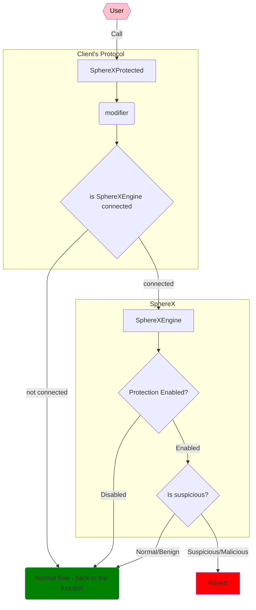

**SphereX Protect** is the main on-chain logic module, enforcing certain protections on the contracts.

Table of contents: 

- [Setting up for development](#setting-up-for-development)
  - [Getting Started](#getting-started)
  - [Testing](#testing)
- [Understanding SphereX-Protect](#understanding-spherex-protect)
  - [Structure](#structure)
  - [Flow](#flow)
    - [How _suspicious behavior_ is tested for.](#how-suspicious-behavior-is-tested-for)
    - [Disabling the protection:](#disabling-the-protection)
    - [Flow graph](#flow-graph)
  - [Notes regarding SphereXProtected contract](#notes-regarding-spherexprotected-contract)
    - [SphereXProtectedBase](#spherexprotectedbase)
    - [Factory integration note](#factory-integration-note)
  - [Notes regarding SphereXEngine contract](#notes-regarding-spherexengine-contract)
- [Data gathered, Contexts and Theses](#data-gathered-contexts-and-theses)
- [Deployment and usage](#deployment-and-usage)
- [Publish package](#publish-package)
- [Known Issues](#known-issues)


## Setting up for development

### Getting Started

SphereX Protect is built on top of Foundry. To interact with the SphereX Protect project follow these steps:

* Follow [Foundry installation guide](https://book.getfoundry.sh/getting-started/installation)
* run `forge install`
* run `forge build`

In general, you should probably spend some time learning about [Foundry](https://book.getfoundry.sh/).

### Testing

run:

```bash
forge test -vv
```

For running static analyzers:

* Ensure you have rust installed and on the nightly channel

```
curl --proto '=https' --tlsv1.2 -sSf https://sh.rustup.rs | sh
rustup default nightly
```

* Install pipenv environment

```
pipenv install --dev
```

* Run `analyze.sh`

## Understanding SphereX-Protect

### Structure

SphereX Protect consists of two contracts

* `SphereXEngine` - The main logic module. Holds the protection rules. Controlled by a default admin, and an "OPERATOR_ROLE".
* `SphereXProtected` - An abstract contract the customer inherits from in his contracts. Contains the bindings (i.e. `modifier`s) to pass data from current execution to `SphereXEngine`.

* `SphereXProtectedProxy` - The main contract for a protected proxy functionality, structures like oz's Proxy.sol contract, it passes data to the engine for every delegate call to the implementation.

* `ProtectedProxies` - A directory containing several oz proxy patterns such as Transparent, ERC1967, Beacon, etc already integrated with SphereXProtectedProxy for easy out of the box use.

### Flow

During the transaction the various contracts in the protocol send data to the `SphereXEngine`. If at any point in the transaction the `SphereXEngine` classifies the behavior as "suspicious", it **reverts the transaction**.

#### How _suspicious behavior_ is tested for.

Data collection is done using modifiers that are implemented in `SphereXProtected` and are inherited by the various client contracts. This means that if a function is not decorated with our modifier or observed by our proxy, information from that function will not be collected and checked for suspicious behavior.

#### Disabling the protection:

The protection of the engine can be disabled in 2 ways:

1. From the client's contract (the protected client) it can be disabled by calling the function `changeSphereXEngine` with `address(0)` param. This will disable calls to the engine from the modifier.
2. In the engine, the protection can be disabled by calling the function `deactivateAllRules`.

If any of these conditions is met, the protection is disabled (although, disabling from the _protected_ contract will save more gas, as nothing will be sent to the `Engine`).

#### Flow graph



> Note that in this graph we separate the SphereX space from the clients, but actually, the SphereXEngine can be viewed as the security module in the client's protocol.


### Notes regarding SphereXProtected contract

This is an abstract contract with 4 state variable, but to make sure they do not interrupt the layout of the inherited contract's variables, they are actually saved in distinct storage slots. This is why these are not normal state variables with names. These 4 special addresses contain:

1. The address of the SphereXAdmin
   * This account is the only one who can change the address of the OPERATOR state variable, and pass it's role to another address.
2. the address of the pendingSphereXAdmin
   * This state variable is used to implement a two step admin role transfer.
3. the address of the sphereXOperator
   * This account is the only onw responsible for managing the protected contract, including changing the address of the ENGINE.
4. The address of the SphereXEngine - this is the address to which data is sent, and which classifies the transaction (at various points of execution).
   * If this value is `address(0)`, the engine will be bypassed, essentially disabling its protection.

The contract provides functions to transfer the role of the SphereXAdmin, SphereXOperator, and update the address of the engine.

The heart of the contract is its modifiers - `SphereXProtected` provides 3 different modifiers to be used on functions with different visibilities:

1. `sphereXGuardInternal(int256 num)` - used for internal/private functions. The number that should be provided is an id to the function. It should be positive, and we simply use simple counting int starting with 1.
2. `sphereXGuardExternal(int256 num)` - used for external functions. The number has the same meaning and usage as in the internal.
3. `sphereXGuardPublic(int256 num, bytes4 selector)` - used fo public functions. The first param is just like in the previous 2 modifiers, and the `selector` param is the 4 bytes selector of the function.

#### SphereXProtectedBase

The only difference between SphereXProtectedBase and SphereXProtected is the constructor and the init function, the SphereXProtectedBase has explicit initialization process (receives parameters), and the SphereXProtected has an implicit initialization process (initializes the admin to msg.sender and the rest to address(0)).

#### Factory integration note

When integrating the protected contract with a factory pattern there a few key points to look at:

1. The contract created by the factory should inherit from SphereXProtectedBase
2. Upon creating the new contract the process should look something like:

```
ChildContract newChild = new ChildContract(..., sphereXAdmin(), sphereXOperator(), sphereXEngine());
_addAllowedSenderOnChain(address(newChild));
```

### Notes regarding SphereXEngine contract

This contract is the brain of the system. It is managed by an AccessControlDefaultAdminRules pattern (inherited from OpenZeppelin).

The engine has 3 key roles:

1. The owner
   * Controls the operator role address.
2. The operator
   * Controls the engine management functions.
3. The sender adder
   * A unique role granted to mainly on-chain factory contracts, its sole purpose is to allow adding an address to the `allowedSenders`. It has 3 important state variables:
4. `_engineRules` - a bytes8 variable indicating what rules (theses) are applied, 1 for CF, 2 for PrefixTxFlow, if all are off then the engine is deactivated.

* Only one of CF or PrefixTxFlow can be activated (since it's meaningless to activate them both).

2. `allowedSenders` is a set of addresses (mapping from address to bool) that the engine serves. essentially, its the set of client's contracts that inherited `SphereXProtected` and are permitted to send requests to the engine. When the engine is active, if an address that is not in the set calls the engine, it will revert the tx without inspecting it any further.
3. `allowedPatterns` - in this case `patterns` means the allowed behaviors of the transaction. In terms of classical cyber, this is an _Allowlist_ of signatures of transactions that are allowed.
   * Every time a transaction is validated with the engine, the engine extracts it's current pattern (in various ways, more on it in the next sections) and checks if that pattern exists in the `allowedPatterns` set. If not, the transaction is reverted.

In addition, the engine has some internal variables that are used to calculate and track the pattern of the current transaction (`currentPattern` and `callDepth`). Also, it includes all the functions needed for management of the contract:

1. Activating and deactivating the contract
2. Adding and removing `allowedSenders` and `allowedPatterns`.


## Data gathered, Contexts and Theses

All this time we talked about patterns, behavior but we didn't explained what information is gathered, what data points are used to determine if a TX (at a given point in its flow) is valid and approved, or it might be an attack.

A full explanation can be found [here](theses.md), but here is the short version: During the run of the TX, we collect information about the state of the protocol. Currently, a state consists of the list of function calls in the tx (usually we refer to this as _Call Flow_, or _**CF**_ in short), but in the future will include additional properties and features.

The data is collected and saved in some form that is easy and effective to parse and test. For instance, the CF of a transaction is actually saved as `bytes32` - the result of a `keccak256` of each functions id with the previous value in the flow variable (if this is not clear, read about it [here](theses.md))

## Deployment and usage

The contracts in this repo are used on-chain by our clients, but also heavily used in simulations for research and system-testing.

To understand fully how these contracts are used and deployed, read the [in-depth-explanation](./#understanding-spherex-engine).

How a deployment looks like (more or less):

1. Take the client's contract, and add the `SphereXProtected.sol` and `ISphereXEngine.sol` files.
2. Make the client's contract inherit from `SphereXProtected` and add it's modifiers in all the client's functions
   * Assuming the client's contracts have already some inheritance in them, It is not trivial in which base-contracts you should import and use `SphereXProtected` modifiers. It might take some trial-and-error to find the best configuration.
   * Note that at this point you need to know the address of the account that will be used to administer the protected contracts (it's a required param for `SphereXProtected` constructor)
3. Deploy the client's contracts
4. Deploy the Engine, and set all the allowed senders of it (that is, the addresses of all the clients contracts that are protected by this instance of the engine)
5. For each of the client's contracts set the spherex-engine address to the deployed engine.
6. At this point the engine is disabled, so it receives information, but allows all transactions. We usually take some time at this point as a _Training period_ to see what patterns are occurring in the protocol, so that we can add them to the list of allowed patterns.
7. Add allowed patterns to the engine.
8. Enable protection at the engine.

That's it. The protocol is now protected by SphereX.

> See [SphereXProtected.t.sol](test/SphereXProtected.t.sol) as an example

> Note that we have an internal system used to do most of these stages, but it can be a good practice to try and do this manually :)

## Publish package
In order to publish the contracts for the npm package @spherex-xyz/contracts, do the following:
1. hardhat compile (compiled artifacts are included in the package) - `npx hardhat compile`
2. update package.json for the package version, desc, etc
3. npm login
4. npm publish

## Known Issues

* When re-initializing `SphereXProtected` contract the new protected owner will only be set iif the current owner is `address(0)`. It **will not revert** otherwise.
